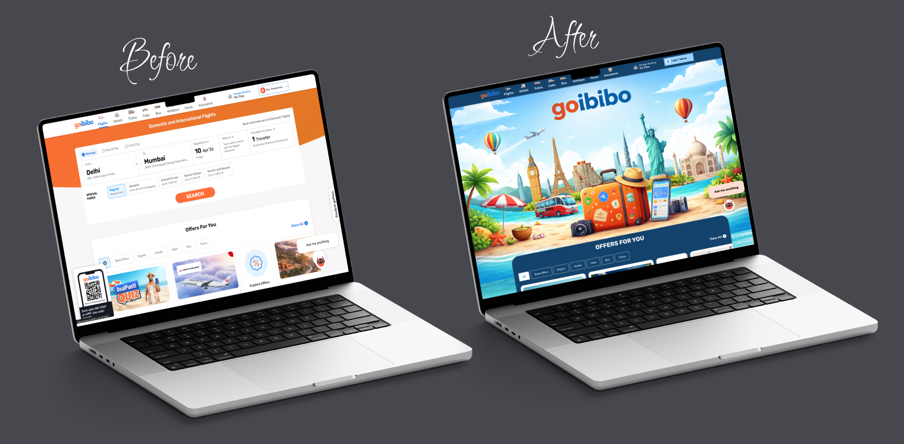

# Goibibo-Redesign-UX-case-Study

# UI/UX Website Redesign 🎯

### 📌 Basic Details

* **Project Type:** UI/UX Mobile App Design
* **Project Name:** Feastify – Food Delivery App
* **Role:** UI/UX Designer
* **Internship Company:** Technglobal Pvt. Ltd.
* **Design Tool:** Figma
* **Project Category:** Internship Major Project

---

## Project Description

This project was completed as my major project during my UI/UX internship, focusing on the redesign of the Goibibo website to improve usability, accessibility, and overall visual appeal.

The goal was to enhance the user experience of the travel booking platform by creating a cleaner, more intuitive, and user-friendly interface.

The redesign process included user research, identifying usability issues, wireframing, designing high-fidelity UI screens, and building an interactive prototype using Figma.

The final design delivers a modern, visually appealing, and easy-to-navigate travel booking experience.
---

## Problem in the Original Website

In the original website, there was a navigation and page-state inconsistency issue.

When users selected the Home page, the flight booking widget remained visible, even though it should ideally appear only on the Flights page.

This created confusion because users expect the content shown on each page to match the selected navigation tab.

Additionally, the blue active indicator line in the header remained under the “Flights” tab, even while the user was on the Home page.

This caused a mismatch between:

the selected page
the visible content
the active navigation state

As a result, users may feel unsure about which page they are currently viewing, leading to a poor and confusing browsing experience.

---

##Solution of My Project

To solve the navigation inconsistency and improve the overall user experience, I completely redesigned multiple pages of the Goibibo website using a user-centered UI/UX approach.

In my redesigned version:

The Home page contains only home-related content, offers, and quick access sections.
The flight booking widget appears only on the Flights page, ensuring that the displayed content matches the selected tab.
The active blue header indicator moves dynamically to the currently selected page, giving clear visual feedback.
I also redesigned the other service pages, including:
Flights
Cabs
Buses
Trains
Hotels 
Each page includes relevant images, icons, and visual sections related to that specific travel service to improve clarity and make the interface more engaging.
The layouts, typography, spacing, and visual hierarchy were redesigned to maintain consistency across all pages.

This redesign improves usability, reduces user confusion, and creates a smooth navigation experience throughout the website.

---

## Technical Details

### Technologies/Components Used

###Design Tool
Figma

### Reference Platform
Goibibo Website – used as the base website for UI/UX redesign study

### Purpose
Wireframing
High-fidelity UI design
Prototype creation
UX analysis and redesign

## Implementation
### Design Process
The implementation of this project was carried out completely in Figma as part of my UI/UX internship project.
The process included:
Research & Analysis
Studied the existing Goibibo website to understand the current layout, booking flow, navigation structure, and user pain points.
Problem Identification
Identified issues such as cluttered design, complex booking flow, and poor visual hierarchy.
Wireframing
Created low-fidelity wireframes to plan the improved structure and user journey.
UI Redesign
Designed high-fidelity screens with a modern layout, improved typography, better spacing, and a clean interface.
Prototype Creation
Built an interactive prototype in Figma to demonstrate the user flow and redesigned booking experience.
Final Review
Refined the design based on UI/UX principles to ensure better usability and accessibility.

---

## Project Documentation

The documentation covers the complete design process, including:

Research and analysis of the existing Goibibo website
Identification of UX issues and pain points
Low-fidelity wireframes for improved layout and user flow
High-fidelity UI screens designed in Figma
Interactive prototype demonstrating the booking journey
Final redesign screens with modern and user-friendly interface

The project was documented with proper design rationale, screen explanations, and before/after improvements to highlight the usability enhancements made during the redesign process.

### Compare Before and After

 

---

Live Prototype Link

Figma Prototype:
(https://www.figma.com/proto/kg84l0kVQv17IGVD6cpNme/Goibibo-redesign?page-id=0%3A1&node-id=10-2657&viewport=901%2C54%2C0.2&t=60fszbJFnoInRIXD-1&scaling=min-zoom&content-scaling=fixed&starting-point-node-id=10%3A2657)

